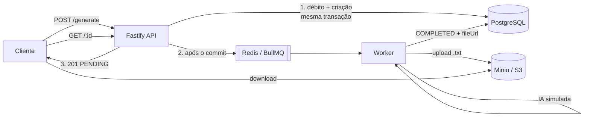

# AI Content Generator API

API assíncrona de geração de conteúdo por IA. O cliente pede um texto sobre um tópico, a API **responde na hora** com um identificador, e o processamento acontece em segundo plano — a requisição HTTP nunca espera a IA.

Cada geração custa **um crédito** do usuário. O pedido é aceito, registrado como `PENDING` e publicado numa fila; um Worker separado consome a fila, gera o texto, envia o `.txt` para o storage S3 e conclui o conteúdo com a URL pública do arquivo. Enquanto isso o cliente acompanha o estado por `GET`, e pode cancelar a qualquer momento antes da conclusão.

O que o projeto trata de verdade, e não apenas no caminho feliz: **concorrência de crédito** (duas requisições simultâneas com um crédito resultam em uma aceita e uma recusada, sem saldo negativo), **retry com backoff** quando a IA falha, **cancelamento que sempre vence** o Worker mesmo chegando no meio do processamento, **idempotência** contra entregas duplicadas da fila, e **compensação** quando a fila fica indisponível depois de o crédito já ter sido cobrado.

---

## Stack

| Camada | Tecnologia |
|---|---|
| Runtime | Node.js 22 (ESM nativo) |
| Linguagem | TypeScript 6, modo estrito |
| HTTP | Fastify 5 |
| Validação | Zod 4 (mesma fonte para runtime e OpenAPI) |
| Banco | PostgreSQL 16 + Prisma 7 (driver adapter `pg`) |
| Fila | Redis 7 + BullMQ 5 |
| Storage | Minio (S3-compatível) + AWS SDK v3 |
| Documentação | Swagger / OpenAPI em `/docs` |
| Testes | Vitest 4 |
| Infra local | Docker Compose |

---

## Arquitetura



A ordem dos três primeiros passos é deliberada: débito e criação são **atômicos**, o job só é publicado **depois do commit**, e a resposta sai sem esperar o Worker.

**API e Worker são processos separados**, na mesma imagem Docker com `command` diferente. O Worker não serve HTTP e não importa rotas; a API não faz upload e nem recebe credenciais de S3.

### Módulos

```text
src/
  config/      env por processo (base, API, Worker), logger
  modules/
    contents/  rotas, service, repositório, máquina de estados, catálogo de falhas
    users/     repositório de crédito (operações condicionais)
    health/    /health e /ready
  infra/
    db/        client Prisma
    queue/     conexões Redis, fila BullMQ
    storage/   cliente S3 e serviço de storage
  worker/      processor, Worker BullMQ, IA simulada
  shared/      erros de domínio, handler global
```

A separação é **por feature**, não por camada cerimonial: cada módulo tem rota, service e repositório juntos. O service não conhece `FastifyRequest`; o repositório expõe operações condicionais, não getters e setters.

---

## Pré-requisitos

- **Docker Desktop** (ou Docker Engine + Compose v2) — é o único requisito para subir tudo.
- **Git**.
- **Node.js 22+** apenas se você for rodar os testes fora dos containers.

Portas usadas no host: **3000** (API), **5432** (PostgreSQL), **6379** (Redis), **9000** (Minio API), **9001** (console do Minio). Todas configuráveis no `.env`.

---

## Como executar

**Linux / macOS:**

```bash
cp .env.example .env
docker compose up --build
```

**Windows (PowerShell):**

```powershell
Copy-Item .env.example .env
docker compose up --build
```

É só isso. Não é preciso rodar migrations nem seed à mão. O Compose orquestra a ordem:

1. `postgres`, `redis` e `minio` sobem e ficam saudáveis;
2. `migrate` (one-shot) aplica as migrations e, com `RUN_SEED=true` — o padrão do `.env.example` —, roda o seed;
3. `minio-init` (one-shot) cria o bucket `ai-content` e aplica a policy de leitura pública;
4. `api` e `worker` sobem depois que os one-shots terminam com sucesso.

Para rodar em segundo plano, use `docker compose up --build -d`.

### Serviços e URLs

| O quê | URL |
|---|---|
| API | http://localhost:3000 |
| Swagger UI | http://localhost:3000/docs |
| OpenAPI JSON | http://localhost:3000/docs/json |
| Liveness | http://localhost:3000/health |
| Readiness | http://localhost:3000/ready |
| Minio (API S3) | http://localhost:9000 |
| Minio (console) | http://localhost:9001 |

Credenciais do console do Minio: **`minioadmin` / `minioadmin`** — valores locais e descartáveis, definidos no `.env.example`.

> **O bucket é público por decisão de ambiente local.** É o que faz a `fileUrl` abrir direto no navegador, sem assinatura. Em produção o bucket seria privado e a API devolveria uma URL pré-assinada com expiração.

`/health` responde enquanto o processo estiver vivo. `/ready` verifica **apenas o PostgreSQL** — a razão está em [Trade-offs](#trade-offs-e-limitações).

---

## Usuários do seed

O seed cria três usuários com UUIDs fixos, pensados para o teste manual:

| UUID | Créditos | Para quê |
|---|---|---|
| `00000000-0000-4000-8000-000000000001` | **10** | uso geral |
| `00000000-0000-4000-8000-000000000002` | **1** | reproduzir a corrida de crédito |
| `00000000-0000-4000-8000-000000000003` | **0** | reproduzir o `402` |

O seed é **idempotente** (`upsert`): rodar de novo restaura exatamente esses saldos, sem duplicar nada.

```bash
docker compose run --rm -e RUN_SEED=true migrate
```

---

## Endpoints

Três rotas, exatamente as do enunciado. A referência completa e navegável está no [Swagger](http://localhost:3000/docs).

### `POST /api/content/generate`

Debita um crédito, cria o conteúdo e publica o job. Responde **imediatamente**, sem esperar a IA.

```bash
curl -X POST http://localhost:3000/api/content/generate \
  -H "Content-Type: application/json" \
  -d '{"userId":"00000000-0000-4000-8000-000000000001","topic":"Inteligência artificial aplicada ao varejo"}'
```

```json
{
  "id": "d966072e-008a-4af0-865e-8ab776f31601",
  "userId": "00000000-0000-4000-8000-000000000001",
  "topic": "Inteligência artificial aplicada ao varejo",
  "status": "PENDING",
  "createdAt": "2026-07-26T18:38:06.965Z"
}
```

`topic` tem entre 3 e 200 caracteres e é trimado antes da validação.

### `GET /api/content/:id`

Consulta o estado. Os estados possíveis:

```text
PENDING ──▶ PROCESSING ──▶ COMPLETED
   │             │
   └─────────────┴────────▶ CANCELED
                 │
                 └────────▶ FAILED
```

`COMPLETED`, `CANCELED` e `FAILED` são **terminais e imutáveis** — nada sai deles.

```bash
curl http://localhost:3000/api/content/d966072e-008a-4af0-865e-8ab776f31601
```

Durante o processamento:

```json
{
  "id": "d966072e-008a-4af0-865e-8ab776f31601",
  "userId": "00000000-0000-4000-8000-000000000001",
  "topic": "Inteligência artificial aplicada ao varejo",
  "status": "PROCESSING",
  "fileUrl": null,
  "errorMessage": null,
  "attempts": 1,
  "createdAt": "2026-07-26T18:38:06.965Z",
  "completedAt": null,
  "canceledAt": null
}
```

Depois de concluído:

```json
{
  "id": "d966072e-008a-4af0-865e-8ab776f31601",
  "userId": "00000000-0000-4000-8000-000000000001",
  "topic": "Inteligência artificial aplicada ao varejo",
  "status": "COMPLETED",
  "fileUrl": "http://localhost:9000/ai-content/contents/d966072e-008a-4af0-865e-8ab776f31601.txt",
  "errorMessage": null,
  "attempts": 1,
  "createdAt": "2026-07-26T18:38:06.965Z",
  "completedAt": "2026-07-26T18:38:12.174Z",
  "canceledAt": null
}
```

**`fileUrl` só é preenchida em `COMPLETED`** — e é gravada na mesma instrução SQL que grava o status, então nunca existe um instante em que o conteúdo está concluído sem arquivo. Baixe direto:

```bash
curl -L http://localhost:9000/ai-content/contents/d966072e-008a-4af0-865e-8ab776f31601.txt
```

### `POST /api/content/:id/cancel`

```bash
curl -X POST http://localhost:3000/api/content/49b50ebe-422a-4585-9596-ffcdd77edb94/cancel
```

```json
{
  "id": "49b50ebe-422a-4585-9596-ffcdd77edb94",
  "status": "CANCELED",
  "canceledAt": "2026-07-26T18:38:24.688Z"
}
```

Permitido em `PENDING` e `PROCESSING` — inclusive **durante** os 5 segundos da IA e durante o upload. Cancelar um conteúdo já terminal responde `409` com o código do estado que bloqueou:

```json
{
  "error": {
    "code": "CONTENT_ALREADY_COMPLETED",
    "message": "Content has already been completed and cannot be canceled.",
    "requestId": "affbd541-aa3e-45a6-868b-2f9a1d598922"
  }
}
```

---

## Créditos

Cada geração custa **um crédito**, debitado na mesma transação que cria o conteúdo. Sem saldo, a requisição é recusada com `402` e **nada** é criado:

```json
{
  "error": {
    "code": "INSUFFICIENT_CREDITS",
    "message": "User has no credits available.",
    "requestId": "0de76f07-624d-49f6-80b6-1dd9d36b7726"
  }
}
```

Com **duas requisições simultâneas e um único crédito**, o resultado é sempre um `201` e um `402`, saldo final `0` e exatamente um conteúdo criado. O saldo nunca fica negativo — há inclusive uma constraint `CHECK ("credits" >= 0)` no banco como defesa em profundidade.

Para reproduzir, use o usuário de 1 crédito:

```bash
U=00000000-0000-4000-8000-000000000002
curl -s -o /dev/null -w "%{http_code}\n" -X POST http://localhost:3000/api/content/generate \
  -H "Content-Type: application/json" -d "{\"userId\":\"$U\",\"topic\":\"Corrida de credito\"}" &
curl -s -o /dev/null -w "%{http_code}\n" -X POST http://localhost:3000/api/content/generate \
  -H "Content-Type: application/json" -d "{\"userId\":\"$U\",\"topic\":\"Corrida de credito\"}" &
wait
```

---

## Retry e falhas

A IA é simulada exatamente como o enunciado descreve: espera **5 segundos** e falha em **20%** das execuções. Ambos configuráveis por `AI_DELAY_MS` e `AI_FAILURE_RATE`.

Cada job tem **3 tentativas** com **backoff exponencial** (~2 s e ~4 s). Entre as tentativas o conteúdo **permanece em `PROCESSING`** — ele nunca volta para `PENDING` nem pisca em `FAILED`. O estado `FAILED` só é gravado quando as três tentativas se esgotam.

Falha de **upload** segue a mesma política de retry da falha de IA, com código próprio.

`errorMessage` vem de um catálogo fechado e sanitizado — nunca mensagem de biblioteca, stack trace, endpoint ou credencial:

| Código | Quando |
|---|---|
| `AI_GENERATION_FAILED` | as 3 tentativas de geração falharam |
| `UPLOAD_FAILED` | as 3 tentativas de upload falharam |
| `QUEUE_UNAVAILABLE` | o job não pôde ser publicado; **o crédito foi estornado** |

Para ver o retry de forma determinística, suba o Worker com a taxa forçada:

```bash
docker compose run -d --rm --no-deps -e AI_FAILURE_RATE=1 --name worker-fail worker
docker compose stop worker
# ... gere um conteúdo e acompanhe: PROCESSING ×3 → FAILED / AI_GENERATION_FAILED
docker rm -f worker-fail && docker compose up -d worker
```

---

## Decisões de concorrência e resiliência

Esta é a parte que o enunciado destaca, então vale explicar o **mecanismo**, não a intenção.

**O crédito é debitado por um `UPDATE` condicional atômico**, sem leitura prévia:

```sql
UPDATE users SET credits = credits - 1 WHERE id = $1 AND credits > 0;
```

A implementação ingênua (`SELECT` → `if (credits > 0)` → `UPDATE`) tem uma janela entre a leitura e a escrita em que duas requisições concorrentes leem `credits = 1`, ambas passam no `if`, e o saldo vira `-1`. Com o predicado **dentro** do `UPDATE`, o PostgreSQL serializa o acesso à linha: a segunda transação bloqueia no lock e, ao obtê-lo, reavalia `credits > 0` contra a versão já atualizada, não afetando linha alguma. O número de linhas afetadas é a resposta autoritativa, e vale para N réplicas da API sem coordenação externa. **A criação do conteúdo acontece na mesma transação do débito** — debitar e falhar ao inserir cobraria o usuário por nada.

**O job só é publicado depois do commit.** Publicar dentro da transação permitiria ao Worker consumir o job e não encontrar o `contentId`, que ainda não existiria. Fora dela, o pior caso é um `PENDING` sem job — e é isso que a **compensação** resolve: se o `queue.add` falha, uma transação própria marca o conteúdo como `FAILED`/`QUEUE_UNAVAILABLE` e estorna o crédito, respondendo `503`. A compensação é **idempotente pelo predicado do banco** (`WHERE status = 'PENDING' AND "creditRefundedAt" IS NULL`), não por flag na aplicação: uma segunda execução não encontra linha e o crédito não volta duas vezes.

**`jobId = contentId`**, o que dá deduplicação de graça enquanto o job existir, e rastreabilidade direta entre a fila e a linha do banco. Como toda fila entrega *at-least-once*, o **Worker é idempotente**: reprocessar um conteúdo em estado terminal é no-op, e o job encerra em sucesso sem tocar em banco, storage ou crédito.

**Nenhuma escrita de status acontece sem predicado do estado de origem.** Todas as transições são `UPDATE ... WHERE status = <origem>` com verificação do número de linhas afetadas — nunca `SELECT` seguido de `if` seguido de `UPDATE`. É esse conjunto de predicados que torna os estados terminais imutáveis: `COMPLETED`, `CANCELED` e `FAILED` não aparecem como origem em nenhuma transição.

**A finalização com sucesso é `UPDATE ... SET status = 'COMPLETED' ... WHERE status = 'PROCESSING'`** — e é aí que mora a garantia do cancelamento. Um `CANCELED` gravado durante os 5 segundos da IA ou durante o upload faz esse `UPDATE` não encontrar linha nenhuma, e o Worker aceita que perdeu a corrida. Não é uma questão de checar antes: é a cláusula que o PostgreSQL avalia atomicamente sob lock de linha. `status`, `fileKey`, `fileUrl` e `completedAt` são gravados na **mesma instrução**, de modo que nunca existe um `COMPLETED` sem arquivo.

**A chave do arquivo é determinística** (`contents/{contentId}.txt`), o que torna o retry idempotente no storage: três tentativas gravam no mesmo objeto em vez de deixarem arquivos mortos. O preço é que duas execuções concorrentes do mesmo conteúdo escrevem no mesmo lugar — então **a limpeza de objeto órfão não é cega**. Quando a finalização condicional não afeta linha, o processor relê o conteúdo e decide: se um `COMPLETED` referencia aquela mesma chave, o objeto é **preservado** (é o arquivo que a API acabou de prometer ao cliente); se o conteúdo está `CANCELED`, `FAILED` ou sumiu, o objeto é removido em *best-effort*. A regra que ordena todos os casos é *nunca apagar objeto referenciado por um `COMPLETED`* — um órfão custa alguns kilobytes, um `COMPLETED` apontando para arquivo inexistente é dado corrompido.

---

## Tratamento de erros

Todas as respostas de erro usam o mesmo envelope, com um `requestId` para correlação com os logs:

```json
{
  "error": {
    "code": "INSUFFICIENT_CREDITS",
    "message": "User has no credits available.",
    "requestId": "0de76f07-624d-49f6-80b6-1dd9d36b7726"
  }
}
```

| HTTP | Código | Quando |
|---|---|---|
| `400` | `VALIDATION_ERROR` | corpo ou parâmetro inválido; acompanha `issues` com campo e motivo |
| `402` | `INSUFFICIENT_CREDITS` | usuário existe, mas sem saldo |
| `404` | `USER_NOT_FOUND` | `userId` inexistente |
| `404` | `CONTENT_NOT_FOUND` | conteúdo inexistente |
| `404` | `ROUTE_NOT_FOUND` | rota inexistente |
| `409` | `CONTENT_ALREADY_COMPLETED` · `CONTENT_ALREADY_CANCELED` · `CONTENT_ALREADY_FAILED` | cancelamento de conteúdo terminal |
| `503` | `QUEUE_UNAVAILABLE` | fila indisponível; o crédito **já foi estornado** |
| `500` | `INTERNAL_ERROR` | erro inesperado, com mensagem genérica |

**Nenhuma resposta expõe stack trace, mensagem de biblioteca, caminho de arquivo ou string de conexão** — o detalhe original fica só no log estruturado. Campos internos como `fileKey` e `creditRefundedAt` não fazem parte do contrato público.

---

## Testes

```bash
npm ci
npm test
```

| Comando | O que roda | Precisa de quê |
|---|---|---|
| `npm run test:unit` | 122 testes de lógica pura e HTTP com `inject()` | nada |
| `npm run test:integration` | 59 testes com PostgreSQL e Redis **reais** | `docker compose up -d postgres redis` |
| `npm test` | os 181 acima | PostgreSQL e Redis |
| `npm run test:e2e` | 1 E2E do fluxo completo | stack completa de pé |
| `npm run validate` | `prisma generate` + `validate` + typecheck + lint + format + unitários + build | nada |

**Total: 181 testes na suíte padrão + 1 E2E.**

Os testes de integração usam um banco **dedicado** (`ai_content_test`, criado sozinho na primeira execução) e o Redis **database 15** — guardas recusam qualquer banco sem sufixo `_test` e o Redis database 0, para que a limpeza entre testes nunca encoste no ambiente de desenvolvimento.

O storage é o único duplo nos testes de concorrência: o que eles provam são decisões do processor — quando enviar, quando **não** enviar, e quando remover um objeto sem apagar o arquivo de outra execução —, e nada disso é garantia do S3. Nenhum teste usa `sleep` fixo como sincronização.

O **E2E** é o único teste sem nenhum duplo: API real em HTTP, Worker real, PostgreSQL, Redis e Minio reais, com o download feito pelo mesmo link que o avaliador abriria no navegador. Ele prova a **montagem** do Compose — uma URL pública mal configurada passa nos 181 testes de integração e falha aqui. Fica fora do `npm test` por construção, em arquivo de configuração próprio.

O runner do E2E recria o Worker com a IA determinística, executa o teste, e **restaura os padrões (`AI_FAILURE_RATE=0.2`, `AI_DELAY_MS=5000`) em qualquer desfecho** — inclusive quando o teste falha —, verificando ao final que o container voltou ativo e com os valores corretos. Ele cria um usuário com UUID exclusivo e, no fim, apaga apenas os dados que criou; nunca trunca tabelas nem esvazia o bucket.

---

## Comandos úteis

```bash
docker compose ps                 # estado dos serviços
docker compose logs -f api        # logs da API
docker compose logs -f worker     # logs do Worker (útil para ver o retry acontecendo)
docker compose stop               # para tudo, preservando dados
docker compose start              # sobe de novo
docker compose down               # remove containers; os volumes (dados) permanecem
```

`docker compose down` **sem** `-v` preserva os volumes de PostgreSQL, Redis e Minio. Use `-v` apenas se quiser mesmo começar do zero.

---

## Trade-offs e limitações

Escolhas conscientes, não omissões:

- **Sem autenticação.** O enunciado fornece o `userId` no corpo da requisição, então é isso que a API usa. Em produção, `userId` viria de um JWT validado num hook `preHandler`, e `GET /:id` e `/cancel` verificariam posse do conteúdo.
- **Bucket público, só no ambiente local.** É o que faz a `fileUrl` abrir direto no navegador. Em produção o bucket seria privado e a URL, pré-assinada com expiração.
- **Endereço interno e URL pública são variáveis separadas** (`S3_ENDPOINT` e `S3_PUBLIC_BASE_URL`) e nunca se cruzam no código. Persistir o endpoint interno é o erro clássico desta integração: funciona em todo teste feito de dentro da rede do Docker e entrega ao cliente um link que não resolve.
- **Sem Transactional Outbox.** A escrita dupla PostgreSQL↔Redis é resolvida por enqueue pós-commit com compensação idempotente. A Outbox fecharia uma janela de milissegundos ao custo de tabela, processo relay e monitoramento de lag — desproporcional para este escopo. A migração futura é barata justamente porque o consumidor já é idempotente: troca-se o publisher, não o Worker.
- **Existe uma janela residual** entre o commit e a compensação: só um crash abrupto do processo (não um `SIGTERM`, que é drenado) exatamente nesse intervalo deixaria um `PENDING` órfão. Um **sweeper** foi avaliado e **conscientemente rejeitado**: exigiria agendador, coordenação entre réplicas e observabilidade próprios — mais superfície do que a compensação inteira — para fechar uma janela mais estreita, e seria uma aproximação da Outbox com garantia pior.
- **`/ready` verifica apenas o PostgreSQL.** Redis é dependência *parcial*: sem ele, `POST /generate` responde `503` com o crédito estornado, mas `GET` e `/cancel` continuam corretos — e cancelar é justamente o que se quer poder fazer quando o processamento está degradado. Marcar a réplica como *not ready* tiraria do ar dois endpoints que funcionam para sinalizar a falha de um terceiro que já se reporta com código HTTP próprio. O mesmo vale para o S3, que só o Worker usa.
- **Cancelamento e falha definitiva não estornam crédito.** O crédito pagou um processamento que de fato foi tentado. **Só a falha de publicação na fila estorna**, porque nesse caso nada chegou a ser processado.
- **Sem verificação de posse** em `GET /:id` e `/cancel`, pela mesma razão da autenticação: o enunciado não fornece identidade nesses endpoints.

---

## Variáveis de ambiente

Todas documentadas em [`.env.example`](.env.example), separadas entre as que a aplicação valida e as que só configuram os containers. Destaques:

| Variável | Padrão | Papel |
|---|---|---|
| `AI_DELAY_MS` | `5000` | espera da IA simulada |
| `AI_FAILURE_RATE` | `0.2` | probabilidade de falha da IA (0 a 1) |
| `JOB_ATTEMPTS` | `3` | tentativas por job, contando a primeira |
| `RUN_SEED` | `true` | roda o seed no serviço `migrate` |
| `S3_ENDPOINT` | `http://minio:9000` (no Compose) | por onde o Worker fala com o storage |
| `S3_PUBLIC_BASE_URL` | `http://localhost:9000` | base da URL persistida em `fileUrl` |

A configuração é validada **por processo**: a API declara Redis e `JOB_ATTEMPTS`, o Worker declara Redis, IA e S3, e o container de migrations declara apenas `DATABASE_URL`. Nenhum processo é obrigado a fornecer credencial que não usa — em particular, a API nunca recebe `S3_SECRET_ACCESS_KEY`. Configuração ausente **falha no boot**, com mensagem que cita o nome da variável e nunca o valor.

---

## Estrutura do projeto

```text
src/
  config/      schemas de ambiente por processo, logger
  modules/     contents, users, health
  infra/       db (Prisma), queue (Redis/BullMQ), storage (S3)
  worker/      processor, Worker, IA simulada
  shared/      erros de domínio, handler HTTP global
prisma/        schema, migrations, seed
test/
  unit/        lógica pura, sem I/O
  integration/ PostgreSQL e Redis reais
  e2e/         fluxo completo contra a stack
  helpers/     fixtures, fakes, sincronização
docker/        script de inicialização do Minio
scripts/       runner do E2E
```
